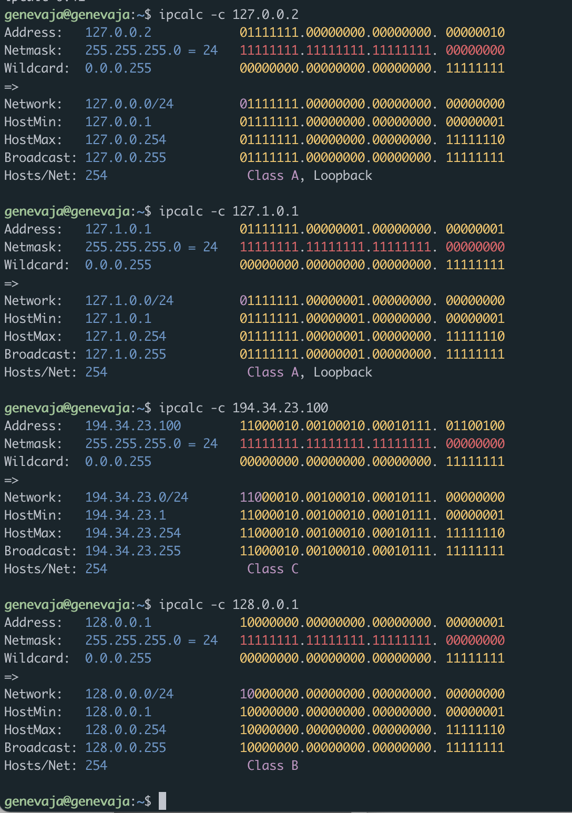
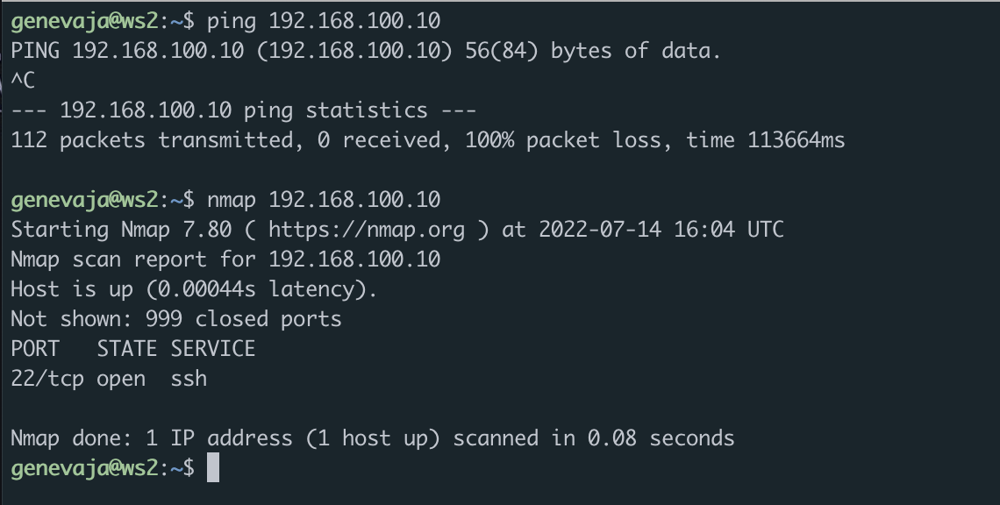
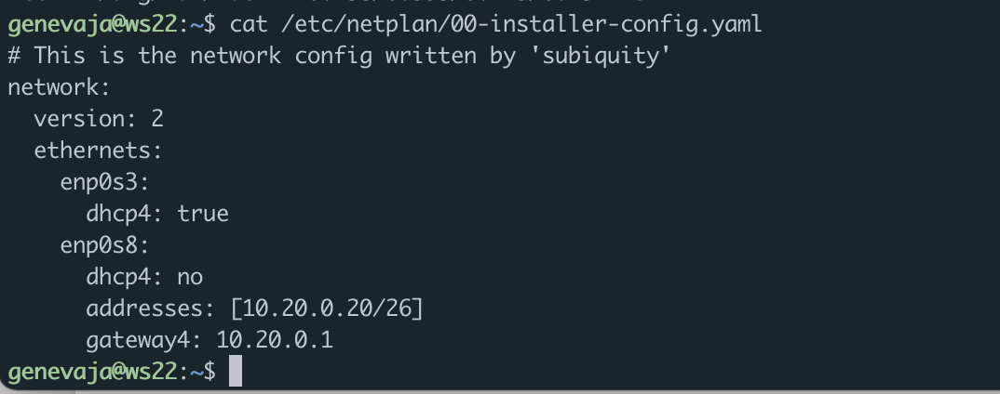
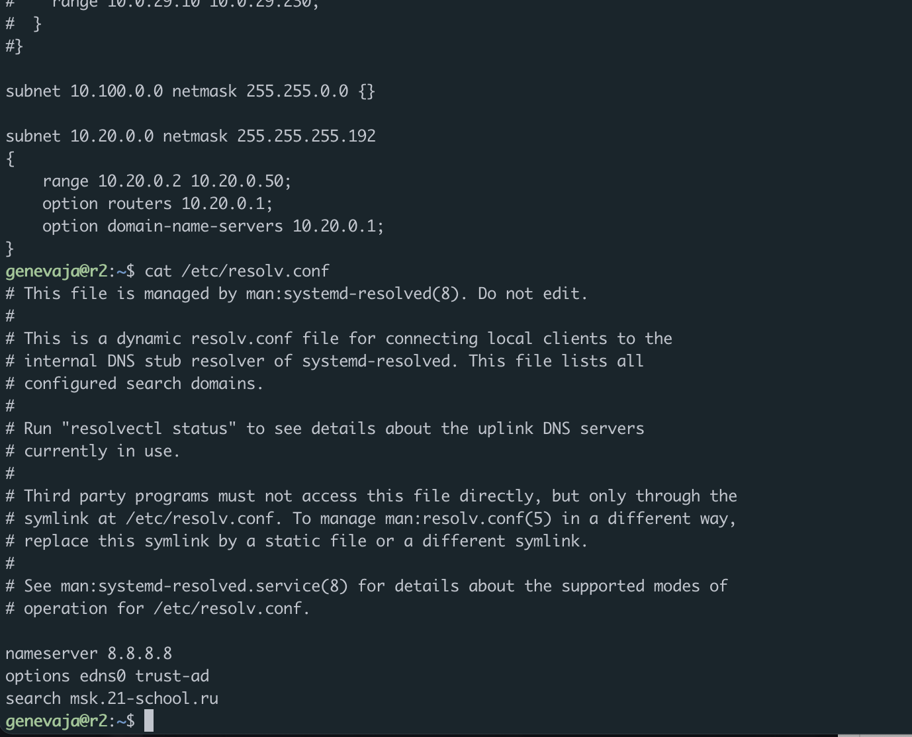
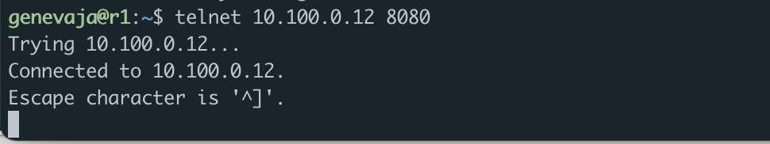

# D02\_LinuxNetwork-0 genevaja

## Part 1. Инструмент ipcalc
### 1.1 Сети и маски
- Определить адрес сети 192.167.38.54/13
- 
- Перевод маски в префиксную и двоичную запись
- 
- 
- Для перевода двоичной записи в обычную используются значения октетов. Например, для адреса 
11111111.11111111.11111111.11110000 маска будет равняться 255.255.255.240. Для отображения префиксной записи маски необходимо посчитать количество единиц. Для примера выше форма записи будет /28
- Минимальный и максимальный хост в сети 12.167.38.4 при маске /8
- 
- Минимальный и максимальный хост в сети 12.167.38.4 при маске 11111111.11111111.00000000.00000000
- 
- Минимальный и максимальный хост в сети 12.167.38.4 при маске 255.255.254.0
- 
- Минимальный и максимальный хост в сети 12.167.38.4 при маске /4
- 

### 1.2 localhost
- Только те адреса, которые начинаются на 127.х.х.х являются loopback адресами
- 

### 1.3 Диапазоны и сегменты сетей
- В качестве публичного можно использовать только следующие адреса:
1. 134.43.0.2
2. 172.0.2.1
3. 192.172.0.1
4. 172.68.0.2
5. 192.169.168.1
- 
- Остальные адреса могут работать только в качестве частных
- Для сети 10.10.0.0/18 шлюзами могут быть адреса из диапазона hostmin-hostmax
То есть 10.10.0.2 10.10.10.10
- 

## Part 2. Статическая маршрутизация между двумя машинами
- 
- 
1. ws1 - Внутренней сети соответствует интерфейс enp0s8
2. ws2 - Внутренней сети соответствует интерфейс enp0s8 (точное соответствие с ws1 из-за клонирования)
- 
- 
- 
- 
### 2.1 Добавление статического маршрута вручную
- 
- 
### 2.2 Добавление статического маршрута с сохранением
- 
- 
- 
- 
## Part 3. Утилита iperf3
### 3.1 Перевести и записать в отчёт: 
- 8 Mbps = 1000 B/s = 1 MB/s
- 100 MB/s = 100000 KB/s = 800000 kbs
- 1 Gbps = 1000 Mbps
### 3.2 Утилита iperf3
- Для замеров скорости я предварительно включил проверяемую машину в режим сервера при помощи команды iperf3 -s
- 
- 
## Part 4. Сетевой экран
### 4.1 Утилита iptables
- 
- 
- Стратегия первого файла предполагает сначала запрет на OUTPUT если идёт запрос по протоколу icmp
- Стратегия второго файла предполагает сначала разрешение на OUTPUT если идёт запрос по протоколу icmp
### 4.2 Утилита nmap
- 
- 
## Part 5. Статическая маршрутизация сети
### 5.1 Настройка адресов машин
- 
- 
- 
- 
- 
### 5.2 Включение переадресасии IP-адресов
- Временная переадресация
- 
- 
- Постоянная переадресация
- 
- 
### 5.3 Установка маршрута по-умолчанию
- 
- 
- 
- 
- 
- 
- 
### 5.4 Добавление статических маршрутов
- 
- 
- 
- 
- 
- Для адреса 10.10.0.0 был выбран маршрут, отличный от 0.0.0.0/0, так как последний означает отсутствие конкретного адреса в качестве следующего перехода на пути пакета к конечному получателю. Когда маршрут по умолчанию используется с маской подсети 0.0.0.0, он соответствует любому адресу.
### 5.5 Построение списка маршрутизаторов
- 
- 
- Traceroute позволяет увидеть промежуточные узлы по путям следования пакетов. Программа отправляет по три ICMP пакета с разным уровнем "жизни" т.н. TTL. Этот параметр указывает на количество узлов, через которые может проходить пакет. При получении сигнала "time exceeded in transit" при повторном отправке пакета время TTL увеличивается на единицу, и так до тех пор, пока не будет достигнут узел получателя.
### 5.6 Использование протокола ICMP при маршрутизации
- 
- 
## Part 6. Динамическая настройка IP с помощью DHCP
- В первую очередь пришлось установить isc-dhcp-server. Потом уже вносить изменения в файлы настройки
- 
- 
- 
- 
- Для запроса нового ip я использовал команду dhclient -v enp0s8
- 
### Part 7. NAT
- 
- 
- 
- 
- 
- 
- 
### Part 8. Дополнительно. Знакомство с SSH Tunnels
- 
- 
- Для установления local TCP forwarding я использовал программу ssh c указанием локального порта 9999
- 
- Для remote TCP forwarding использовал то же самое, но с флагом -R
- 
- 
